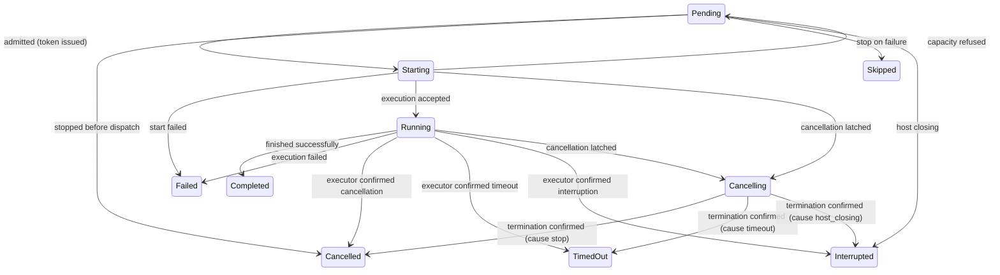
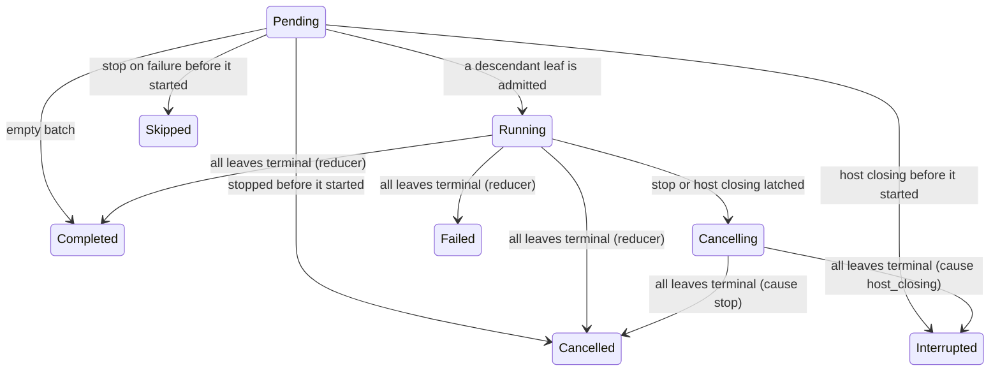
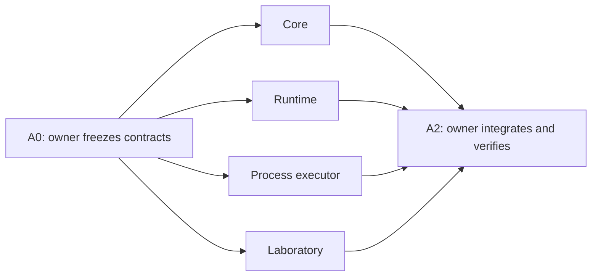

# Job batches — standalone engine and later Rush integration

Status: design only; this document does not authorize implementation or agent
launches. Revision 2 (2026-10-08) makes the contract of sections 2-5
freezable. It resolves the findings of four independent reviews of
revision 1 (`51599fa4`); Appendix A maps every finding to its resolution:

- `docs/reviews/2026-10-08-job-batches-xxs-states.md` (S1-S5)
- `docs/reviews/2026-10-08-job-batches-xxs-api.md` (A1-A9)
- `docs/reviews/2026-10-08-job-batches-xxs-parallel-testing.md` (P1-P8)
- `docs/reviews/2026-10-08-job-batches-xxs-rush-integration.md` (I1-I7)

The original integration investigation used HEAD `322705af`. File names below
are navigation aids, not frozen line-number contracts; re-read the current
implementation before changing it.

## 0. Scope and delivery boundary

The first deliverable is ordinary Go code in this repository:

```text
internal/jobbatch/                  Independent engine and runtime.
internal/jobbatch/testdata/         Deterministic core/runtime inputs.
internal/jobbatch/lab/              Scenario, controlled and process executors.
cmd/batchlab/                      Standalone development executable.
```

There is one module and one implementation. `batchlab` imports the package
that Rush will eventually use; it must not contain a second scheduler.
`internal/jobbatch/lab` is a consumer of the engine, not an engine dependency.
The engine/runtime depend only on the standard library. The process executor
may use `internal/platform` and `golang.org/x/sys`, but not Rush's app,
coordinator, session services, provider configuration, or MCP owner.

**Current scope ends at a working autonomous engine plus batchlab.** No Rush
tool registrations, DB migrations, changes to existing launch paths, new
model prompts, or project pre-refactoring are prerequisites for that delivery.
Section 9 records the later integration work; it is not part of the first
implementation wave.

Required behavior, retained from the operator's original request:

- A batch contains tasks and/or nested batches.
- Parallel batches start eligible work up to their limit and wait for every
  started task. Sequential batches process direct children in order, stopping
  on failure or continuing according to policy.
- Notifications are per-item or aggregate; several batches can coexist.
- Items can be appended to a nonterminal batch. Any item/subtree can be
  stopped. Task output can be inspected. Message-capable executors can receive
  input at any nesting depth.
- Success, failure, cancellation, timeout, interruption, and skipped work are
  distinct. An executor reports outcomes explicitly; the engine never
  interprets natural-language answers.
- Every independent CLI-command, MCP-call, or agent launch will eventually
  enter as a batch with one task. An existing batch's leaf is not wrapped
  again. This is a future integration invariant, tested abstractly now.

Job batches are not the existing `fs_*` batching utilities. This component
owns group scheduling and policy, not filesystem-operation atomicity.

## 1. Architecture and ownership of truth

### 1.1 Pure engine

`Engine` owns a forest of batch trees and their shared scheduling budget.
Keeping shared admission here prevents each batch from independently
allocating the supposedly global limit. The tree is an internal representation,
not another public scheduler.

The engine has no goroutines, mutexes, clock reads, filesystem/network I/O,
process launching, or Rush imports. It accepts events and produces an ordered
transition containing changed views, execution commands, and notices.
The same ordered input events produce the same commands, notices and terminal
states. Time-dependent behavior enters as explicit events, not `time.Now()`
in core.

### 1.2 Runtime

One `Runner` owns one engine, potentially serving many root batches. It
serializes public requests and executor reports through one event loop.
Snapshots are requested through that loop, not by reading the engine from
another goroutine.

The loop applies events and schedules effects in transition order. Blocking
executor work happens outside it. Merely unlocking a mutex before calling an
executor is insufficient: separately dispatched transitions must not reorder
Start and Stop effects or issue duplicate executions.

Host cancellation starts closing; it does not stop the loop. The loop keeps
accepting executor reports until every accepted execution has confirmed
termination (section 3.4).

### 1.3 Executors and observers

The executor owns the actual execution and its output. The engine sees task
identity, admission group, cancellation intent, control results, and explicit
completion. CLI, MCP, and agent are adapter kind names, not branches of the
pure engine. Unknown executor kinds fail validation in the consumer before
launch.

Accepted work becomes terminal only when its executor confirms that the
execution has stopped. No executor error, panic, timeout, or Close deadline is
a substitute for that confirmation (sections 3.1.1 and 3.4).

The public record feed is not durable storage and is not a promise of
exactly-once delivery across crashes. It must not block executor cancellation
or the state loop. The final snapshot/Wait result remains authoritative even
if an observer falls behind.

## 2. Contract to freeze before parallel implementation

The integration owner implements the shared declarations in phase A0 before
spawning implementers. All slices use those declarations. The following names
and semantics are the shared contract, not competing design suggestions.

**What A0 writes in Go, and what it does not (P1).** Go has no forward
declarations: a function declared without a body is an external (assembly)
implementation, and a second declaration of the same name is a
redeclaration. A0 therefore writes only data declarations — types, interface
types, enum constants, error sentinels — plus small pure methods on those
types that every slice must answer identically (for example
`State.Terminal`). The function and method signatures listed in this section
and in section 5.3 are frozen by this document; each is declared exactly
once, with its real body, by its owning slice (section 7.2). No placeholder
bodies, function variables or empty concrete structs exist to make early
compilation possible.

```go
type ID string
type Mode string   // "parallel", "sequential".
type OnFail string // "stop", "continue".
type Notify string // "each", "all".
type State string  // Section 3.1.
type Cause string  // "stop", "timeout", "host_closing", "stop_on_fail".

type TaskSpec struct {
    Kind    string
    Group   string          // Empty: the default group, bounded globally only.
    Payload json.RawMessage // Opaque to the engine; read-only once accepted.
    Timeout time.Duration   // Zero means no item timeout.
}
type BatchSpec struct {
    Mode        Mode
    OnFail      OnFail
    Notify      Notify
    MaxParallel int // 0: no cap of its own (section 3.2).
    Items       []Spec
}
type Spec struct {
    Task  *TaskSpec
    Batch *BatchSpec // Exactly one of Task/Batch is set.
}
type Limits struct {
    MaxConcurrent int
    ByGroup       map[string]int
    MaxDepth      int
    MaxNodes      int // Per root, including its nested batches.
}
type Result struct {
    State   State           // Completed, Failed, Cancelled, TimedOut, Interrupted.
    Code    string          // Short machine code; safe to journal.
    Summary string          // For explicit inspection only; never journaled.
    Details json.RawMessage // Opaque; never logged automatically.
}
type Launch struct {
    ID    ID
    Token uint64 // Admission-attempt identity, unique within one Runner.
    Task  TaskSpec
}

type Executor interface {
    Start(ctx context.Context, l Launch, report func(Result)) (Execution, error)
}
type Execution interface {
    Stop(ctx context.Context) error
}
// Optional capabilities, discovered on the Execution by type assertion.
type OutputReader interface {
    ReadOutput(ctx context.Context, cursor uint64) (OutputChunk, error)
}
type Messenger interface {
    Inject(ctx context.Context, msg json.RawMessage) error
}
type Disposer interface {
    Dispose(ctx context.Context) error
}

type RunnerConfig struct {
    Limits          Limits
    Executor        Executor
    ControlTimeout  time.Duration // Bound for each Stop/Dispose call; positive.
    RecordRetention int           // Records kept for Events; positive.
}
type SubmitRequest struct {
    Root ID
    Spec Spec   // A batch (section 2.1).
    Ref  string // Optional caller reference; journaled, never payload.
}
type AddRequest struct {
    Parent ID
    Items  []Spec
    Ref    string
}
```

Enum strings: State is `pending`, `starting`, `running`, `cancelling`,
`completed`, `failed`, `cancelled`, `timed_out`, `interrupted`, `skipped`;
StartRejected reasons are `capacity`, `failure`, `cancelled`. JSON tags are
the snake_case of field names. `Ref` holds at most 128 bytes of
`[A-Za-z0-9._:-]`; `Result.Code` at most 64 bytes of `[a-z0-9_.-]` — the
Runner replaces an invalid code with `invalid_code` at the report boundary.

Public core API:

```go
func NewEngine(Limits) (*Engine, error)
func (e *Engine) Apply(Event) (Transition, error)
func (e *Engine) View(ID) (NodeView, bool)
func (e *Engine) Snapshot(ID) (BatchView, bool)
```

Public runtime API:

```go
func NewRunner(context.Context, RunnerConfig) (*Runner, error)
func (r *Runner) Submit(context.Context, SubmitRequest) (*Batch, error)
func (r *Runner) Add(context.Context, AddRequest) ([]ID, error)
func (r *Runner) Stop(context.Context, ID) error
func (r *Runner) CapacityAvailable(context.Context, string) error
func (r *Runner) View(context.Context, ID) (NodeView, error)
func (r *Runner) Snapshot(context.Context, ID) (BatchView, error)
func (r *Runner) Events(context.Context, uint64) (EventPage, error)
func (r *Runner) Output(context.Context, ID, uint64) (OutputChunk, error)
func (r *Runner) Inject(context.Context, ID, json.RawMessage) error
func (r *Runner) Release(context.Context, ID) error
func (r *Runner) Close(context.Context) error
func (b *Batch) ID() ID
func (b *Batch) Done() <-chan struct{}
func (b *Batch) Wait(context.Context) (Summary, error)
```

Supporting types, also frozen in A0:

- `Event`: Submit{root, spec, ref}, Add{parent, items, ref},
  StopRequested{node}, Started{node, token}, StartRejected{node, token,
  reason, code}, Settled{node, token, result}, ControlReported{node, token,
  op, code}, CapacityAvailable{group}, DeadlineExpired{node, token},
  HostClosing, Release{root}. Invalid, stale or out-of-order events produce
  an error, no mutation, no sequence increment and no commands.
- `Command`: StartLeaf carries the full immutable `Launch` (identity, token,
  kind, group, timeout, payload), so the Runtime needs no lookup to start a
  leaf. StopLeaf carries node, token and cause.
- `Transition`: monotonic sequence of accepted events, the accepted event,
  changed node views, commands, selected notices, newly settled roots.
- `Notice`: root, node, node kind (task, batch, root), state, cause, leaf
  counts. Metadata only.
- `NodeView`: id, root, parent, ordinal, kind; batch policy fields for
  batches and group for tasks; state, latched cause, current token, attempt
  count, reported outcome (state, code, summary — never details), control
  error code. Payload is never a view field. Summary is for explicit
  inspection; it never enters records.
- `Counts`: leaf counts by pending, active (starting, running, cancelling),
  completed, failed, cancelled, timed_out, interrupted, skipped. A nested
  batch is never counted, only its leaves.
- `BatchView`: transition sequence, the batch's own view, its counts, and
  every descendant view in pre-order (section 4.2). `Summary`: root, state,
  counts, sequence — the small immutable aggregate returned by Wait.
- `OutputChunk`: data (a caller-owned copy), next cursor, oldest retained
  cursor, EOF, truncated (section 4.3).
- `Record`/`EventPage`: the public feed (section 4.1).
- Errors: `ErrInvalidSpec`, `ErrDuplicateRoot`, `ErrUnknownNode`,
  `ErrTerminal`, `ErrNotTerminal`, `ErrNotStarted`, `ErrUnsupported`,
  `ErrReleased`, `ErrClosing`, `ErrClosed`, `ErrCloseTimeout`, `ErrGap`,
  `ErrExecutorPanic`, `ErrExecutionDone`, and `ErrCapacity`, which an
  executor wraps in its Start error to signal a typed capacity refusal.

Do not add a mandatory Store interface or DB-style transaction to this scope.

### 2.1 IDs, ownership, and validation

Callers supply a unique nonempty root ID; the contract reserves `.` as the
item-path separator. Descendant IDs are deterministic append-only ordinal
paths, such as `root.1.2`. Parent and ordinal are explicit view fields;
consumers must not parse IDs for ownership. Duplicate root submission fails
without executing anything. Rerunning work requires a new root ID.

Root specs must be batches; the engine rejects a root task. A consumer
normalizes a standalone task to a one-task batch once at ingress. This
normalization preserves the caller's selected policy; it does not normalize
every nested leaf.

Validate a complete Submit/Add subtree before accepting any of it: exactly
one node shape, known mode/policy, nonnegative timeout, valid limits, IDs and
reference, depth/node bounds (Add counts toward the root's `MaxNodes`), and no
irrelevant task/batch-only fields. Add is atomic as a request, not as
execution across tasks. Add returns the new direct children of `Parent` in
input order.

Require positive global, depth, and node limits. Group limits, when supplied,
must be positive; a group without a limit is bounded only globally.
`MaxParallel` is validated as written and never normalized into a number:
0 adds no cap of its own, a positive value caps every active leaf beneath the
batch (section 3.2). Sequential accepts only 0 or 1. Numeric
machine-specific defaults belong to batchlab/Rush, not hardcoded
command/agent categories in core.

Mode is explicit; absent Notify normalizes to `all`. A Sequential batch with
absent OnFail uses `stop`; Parallel requires OnFail to be empty. Root depth
is one and ordinals start at one. These defaults are resolved once, before
subtree validation.

### 2.2 Ownership of mutable values (A7)

| Value | Crosses | Rule |
|---|---|---|
| `RunnerConfig.Limits`, incl. `ByGroup` | caller → Runner | Copied by `NewRunner`; later caller edits have no effect. |
| Submit/Add specs and payloads | caller → Runner | Deep-copied before the request is queued. |
| `Launch`, incl. `Task.Payload` | Runner → executor | Read-only shared data; the executor must not mutate it and need not copy it. |
| `Result` | executor → Runner | Copied once by the report callback. |
| Inject message | caller → executor | Copied by `Runner.Inject`; owned by the executor once `Messenger.Inject` returns nil. |
| `OutputChunk.Data` | executor → caller | A detached copy owned by the caller; the Runner does not copy again. |
| Views, snapshots, summaries, records | Runner → caller | Values that alias no internal state. |

Direct Engine callers transfer ownership of their events to `Apply`. Do not
clone the entire forest on every transition; report changed nodes only.

### 2.3 Requests: acceptance and replies (A5)

- Each public request is queued with a reply slot and an atomic state that
  moves from queued to either accepted (by the loop) or abandoned (by its
  caller). Exactly one of the two wins.
- The loop skips abandoned requests. It applies an accepted request and
  writes its reply without blocking.
- If the caller's context ends and abandonment wins, the request had no
  effect and the caller gets the context error. If acceptance already won,
  the caller waits for the reply — written promptly, because the loop never
  waits for executors — and gets the committed result. There is no
  "maybe accepted" outcome; an accepted Add always reaches its caller with
  its IDs.
- `Stop` returns nil once the stop intent is accepted, or at once if the
  node is already terminal. It never waits for `Execution.Stop` or for
  termination; the executor's answer appears as the node's control error
  (section 3.1.1). Termination is awaited with `Batch.Wait` or by following
  the node's records in `Events`.
- `Batch.Wait` returns the root `Summary` with a nil error for every
  terminal outcome, Failed and Cancelled included; its error describes only
  the wait itself. Cancelling Wait never stops work.
- `CapacityAvailable` returns after acceptance.

## 3. State, scheduling, and races

### 3.1 Lifecycle

Leaf states:



A report's `Result.State` must be Completed, Failed, Cancelled, TimedOut or
Interrupted. Any other value still means the execution ended: the leaf
settles Failed with code `executor_invalid_state`. When a cause was latched
first, the leaf settles with that cause and keeps the reported result as its
outcome (section 3.3).

Natural completion may arrive before Start returns. Runner buffers that
report and publishes Started before Settled for an accepted start. A failed
Start is authoritative: it must return no accepted execution. Start must
honor cancellation and finish its setup in bounded time. If cancellation was
already latched, a rejected start confirms that no execution exists and
settles with the latched cause, not a fresh Failed/Pending state.

Starting/Cancelling still hold their reserved slots until rejection or
confirmed execution termination. A successful Start means accepted work,
not completed work. At most one accepted execution per leaf. Rejected
admission attempts have distinct tokens and may retry without side effects.

Stop/timeout records intent and requests executor cancellation. It does not
pretend a process, MCP call, or agent has already stopped. Executor Stop
returning nil only acknowledges the request; completion confirms termination.

Batch states:



A batch that ran without a latched cause aggregates once all its leaves are
terminal: any Failed/TimedOut/Interrupted ⇒ Failed; otherwise any Cancelled
⇒ Cancelled; otherwise Completed. A batch with a latched cause ends with that
cause; descendant outcomes stay visible in the counts. A Pending successor
that stop-on-fail never started becomes Skipped, and so do its Pending
descendants; descendants that are already terminal keep their state, so an
empty batch that completed earlier is never renamed (S3). Skipped is produced
only by stop-on-fail and never conceals a start error.

Empty batches complete immediately, have zero task counts, and then reject
Add. An item asking for input is not terminal and does not free capacity;
waiting/interaction details belong to its executor.

#### 3.1.1 Errors by phase (S2, A2)

1. **Start rejected.** A non-nil error from `Start` is authoritative: no
   execution exists. `errors.Is(err, ErrCapacity)` is a capacity refusal
   (section 3.2). Any other error is a start failure: the leaf becomes Failed
   with the error's `Code() string` if it provides one, else `start_failed`.
   A nil execution with a nil error fails with `start_nil_execution`. The
   Runner recovers a panic inside `Start` as a start failure with code
   `start_panic`. When cancellation was latched before the rejection, the
   leaf settles with the latched cause instead.
   The executor, not the Runner, guarantees that a rejected or panicking
   Start leaves no running process, call or agent behind (executor-owned
   setup cleanup). The Runner cannot verify that and does not claim to. A
   report made by a rejected attempt is ignored and journaled as
   `executor_contract`.
2. **Accepted execution.** Only the attempt's report settles it, and a
   report means the execution has stopped. An error or panic from
   `Execution.Stop`, or a Stop exceeding `ControlTimeout`, is a control
   failure: the Runner applies `ControlReported` with code `stop_failed`,
   `stop_panic` or `stop_timeout`, which sets the node's control error and
   changes neither its state nor admission; the reservation stays held. A
   nil Stop only acknowledges the request and clears the control error.
   Calling `Runner.Stop` again on a node whose last control report failed
   re-issues StopLeaf; otherwise repeated Stop is a no-op.
3. **Inspection and input.** Errors from `ReadOutput`/`Inject` return to
   their callers, a panic as `ErrExecutorPanic`; neither changes state.
4. **Executor goroutines.** A panic inside a goroutine the executor owns is
   the executor's to contain; its protocol must still either report
   termination or keep the execution alive. The Runner cannot catch it.
5. **No synthetic termination.** No rule in this document turns an error, a
   panic, a timeout, or a Close deadline into Settled. Work an executor never
   confirms stays visible and nonterminal.

### 3.2 Admission and fairness

A Pending leaf L without a latched cause is **eligible** when all of these
hold (active means Starting, Running or Cancelling; batch nodes consume no
slot):

1. **Sequential gate:** for every Sequential ancestor, L lies inside that
   ancestor's current direct child — the lowest-ordinal direct child that is
   not terminal. A nested batch settles before the next direct sibling
   starts.
2. **Global:** active leaves in the Runner < `MaxConcurrent`.
3. **Group:** if `ByGroup[g]` is set for L's group g, active leaves of g <
   `ByGroup[g]`.
4. **Subtree caps:** for every ancestor with `MaxParallel > 0`, active
   leaves beneath it < `MaxParallel`. `MaxParallel = 0` adds no cap and never
   inherits a number from the global or a group budget.
5. **Capacity block:** L's group is not capacity-blocked (below).
6. **Root:** the root is neither closing nor released.

Consequences (S4): `Sequential(0)` runs its current child under the child's
own rules, so a nested Parallel child may overlap its leaves;
`Sequential(1)` additionally limits its whole subtree to one active leaf. A
batch mixing groups `g:1` and `h:2` with `MaxParallel = 0` gets no common
cap of 1 from `g`.

**Selection.** After each accepted event the engine admits eligible leaves
until none is left. It walks roots round-robin from a cursor that persists
across transitions and, within a root, picks the eligible leaf with the
lowest pre-order position. A leaf blocked by its group is skipped, not
waited behind, so a blocked group never holds back another group or another
root. Releasing a slot reconsiders waiting work across the forest, including
a root that has never started a leaf.

**Capacity refusal without lost wake-ups (S1).** Each group g has an
availability generation `gen[g]`, incremented by every accepted
`CapacityAvailable(g)` and by every settlement of an accepted execution in g.
A StartLeaf records `gen[g]` at authorization. A capacity `StartRejected`
returns the leaf to Pending and releases its reservation. If `gen[g]` has
advanced since that attempt was authorized, the group stays eligible: the
signal arrived while the attempt was in flight and allows one retry.
Otherwise the group is blocked at the current generation and becomes
eligible again only when `gen[g]` advances. A late refusal therefore cannot
erase a signal accepted after its attempt began, a stale refusal cannot
re-block the group after a newer wake-up, and refusals without new signals
never spin. Do not busy-loop or wait only for the same tree to settle.

Operational start failure is Failed, not a capacity refusal. Automatic
retries of failed tasks are out of scope.

**Waiting executions and budgets (I1).** An execution that waits for work it
launched — an agent waiting for its commands — must never have to draw that
work's slot from a budget it holds itself, or a full budget deadlocks. The
engine does not detect such waits and adds no lending primitive in this
scope. Callers put waiting levels in distinct groups whose limits are not
jointly bound by a smaller `MaxConcurrent` (`MaxConcurrent` at least the sum
of those groups' limits); section 9.2 applies this to Rush. A future lending
primitive would be an additive field on `SubmitRequest`, not a breaking
change.

### 3.3 Linearization rules

The event-loop acceptance order, not wall-clock callback order, decides:

1. **Add vs last completion:** Add accepted first extends the batch;
   completion accepted first makes it terminal and subsequent Add fails.
2. **Stop vs dispatch:** stop cancels undispatched tasks. An already
   authorized Start may be in flight; its context is cancelled and the
   returned execution is stopped before waiting for its final report.
   A Start entered with an already-cancelled context must do no side effects.
3. **Stop vs natural completion:** Settled accepted first keeps its natural
   terminal state. Stop accepted first latches cancellation as terminal cause;
   retain the executor's reported outcome as details, not as a second notice.
4. **Repeated/late reports:** reports for terminal nodes or stale launch
   tokens cannot release capacity twice, restart work, or change the winner.
   Late control reports cannot revive a terminal node.
5. **Timeout vs Stop:** the first accepted cancellation cause is retained.
   A later timer cannot relabel an operator stop or a completed task.
6. **Timers are attempt-scoped:** the Runner arms an item's timeout when it
   dispatches StartLeaf (authorization, not queueing) and retires it when
   that attempt is rejected or settles. `DeadlineExpired` carries the token;
   a stale token or a terminal node is rejected, so an old attempt's timer
   cancels neither a Pending leaf nor a newer attempt.
7. **Inject vs settlement:** Inject is accepted only for a leaf whose
   accepted execution is neither terminal nor cancelling at acceptance. The
   executor call runs after acceptance; if the execution ends meanwhile, the
   executor answers `ErrExecutionDone`. A message is never applied to work
   that was already terminal when Inject was accepted.

Report callbacks must return without waiting for the event loop, including
callbacks invoked synchronously by Start. Use a per-attempt completion latch,
not a blocking callback channel that deadlocks Start. Executor errors and
panics follow section 3.1.1; rejected work must not leak a reservation.

Public operation contexts bound request submission/waiting, not task lifetime
(section 2.3). Cancellation of Batch.Wait alone does not stop work. Runner's
host context or explicit Stop controls work lifetime. Rush's eventual
synchronous adapter will explicitly connect caller cancellation to Stop.

### 3.4 Host shutdown, Close and draining (S5)

Host shutdown is distinct from user Stop.

- **Closing** starts at host-context cancellation or at the first `Close`
  call, as one `HostClosing` event. New Submit, Add and Inject fail with
  `ErrClosing`. Pending leaves become Interrupted. Starting and Running
  leaves without a latched cause latch `host_closing` and receive StopLeaf.
- **Draining.** The loop keeps running after closing begins. It accepts
  Start results, reports and control results, and serves View, Snapshot,
  Events, Output, Stop and Release. Executor calls made while draining
  (`Stop`, `Dispose`) use a context detached from the cancelled host context
  and bounded by `ControlTimeout`; a cancelled host or request context never
  makes cleanup useless.
- **Close(ctx)** waits until every root is terminal or ctx ends. On expiry it
  returns an error wrapping `ErrCloseTimeout` that names the unfinished
  nodes. Nothing is settled synthetically, reservations stay held, and Close
  may be called again.
- **Closed.** When every root is terminal the loop exits. A later Close
  returns nil, the other Runner methods return `ErrClosed`, and existing
  `Batch` handles still answer `Done`/`Wait` from their cached Summary.
- An executor that never confirms keeps the Runner draining. That state is
  visible through Snapshot and Close errors, never hidden.

Restart/resumption and cross-process delivery are later work.

## 4. Notifications, output, and injection

Separate three concepts:

- Diagnostic records describe every accepted transition.
- Selected notices implement NotifyEach/NotifyAll.
- Batch.Wait returns one root result; it is not an extra user notification.

### 4.1 Records, notices and the public feed (A1, A3)

`Runner.Events` is the only public stream: a cursor feed of records. Every
record has a gapless producer cursor, the sequence of the transition it came
from, and a type:

- one record per accepted event (`submit`, `add`, `stop_requested`,
  `started`, `start_rejected`, `settled`, `control`, `capacity_available`,
  `deadline_expired`, `host_closing`, `release`), carrying every
  scheduling-relevant field: root, node, token, state, cause, reason, safe
  code, group, `ref`, and for Submit/Add the IDs created;
- one `command` record per engine command, in transition order: start or
  stop, node, token, cause — never the payload;
- one `notice` record per selected notice; one transition may select
  several.

Records never contain payloads, `Result.Summary`/`Details`, injected
messages, output, or arguments. `EventPage` carries the records and the
`Next`, `Oldest` and `Head` cursors. `Events(ctx, cursor)` waits until a
record at or after the cursor exists, the context ends, or the Runner is
closed. Retention is a bounded ring of `RecordRetention` records. A cursor
older than `Oldest` gets `ErrGap` together with `Oldest`; the consumer then
recovers current state through Snapshot/Wait and must not treat the feed as
complete. Slow consumers never block the loop, cancellation or admission.

**Notice selection.** Root completion produces one selected root notice. For
descendant completion, NotifyEach applies to direct children; an ancestor
NotifyAll suppresses ordinary notices inside its subtree. A nested aggregate,
a Skipped batch included, may be announced by its NotifyEach parent without
repeating descendant output. Question/input requests are not engine events
(section 4.4) and are never suppressed by completion-notification policy.

One-task ingress defaults to NotifyAll. Its adapter delivers either the
synchronous result or the root completion notice, never both plus a leaf
notice. Opt-in NotifyEach can expose lifecycle information, but must not
duplicate the full user-facing result.

### 4.2 Discovery (A8)

`Snapshot` accepts any batch node and returns a consistent view at one
transition: the batch, its leaf counts, and every descendant NodeView in
pre-order (parent before children, siblings by ordinal). Consumers address
deep nodes from snapshots and views, never by parsing IDs.

### 4.3 Output (A9)

Each execution exposes at most one byte stream with absolute cursors starting
at 0; the process executor merges stdout and stderr in arrival order.
`ReadOutput(ctx, cursor)`:

- returns retained bytes from `max(cursor, Oldest)`; `Truncated` is set when
  the cursor is older than `Oldest` (retention dropped those bytes), and
  `Next` is the cursor after the returned bytes;
- on a live stream with nothing new, waits until data, EOF or the end of ctx
  (a context error) — no busy polling and no false EOF;
- sets `EOF` only after the execution has terminated and every retained byte
  has been returned.

Typed errors: `ErrNotStarted` (no accepted execution yet), `ErrUnsupported`
(a batch node or an execution without OutputReader), `ErrReleased`,
`ErrUnknownNode`. Output storage and retention belong to the executor.

### 4.4 Injection

Inject resolves node ownership explicitly and is callable at any depth. A
batch node or an execution without Messenger returns `ErrUnsupported`;
Pending/Starting returns `ErrNotStarted`; a terminal or cancelling node
returns `ErrTerminal`; a closing Runner returns `ErrClosing`. No silent no-op
injection. An execution's input callback must not call back synchronously
into a blocking Runner operation.

Question/input transport remains an executor/host concern. A paused lab
execution advertises that state through inspected output and accepts Inject;
the core needs no agent-specific question event to schedule it, and an item
waiting for input stays nonterminal and keeps its slot.

### 4.5 Retention and Release (A6)

After settlement the Runner is the only owner of an execution handle. An
executor must not keep its own registry of finished executions; the
Execution value holds its retained output. Output and Inject take a lease on
the handle through the loop and run outside it.

`Release(root)` is refused with `ErrNotTerminal` while any node of the root
is nonterminal, and only roots can be released. After Release, new Output,
Inject, View and Snapshot calls on that root return `ErrReleased`; leases
already taken finish safely; when the last lease ends, the Runner calls
`Dispose` once (if the execution implements it) bounded by `ControlTimeout`.
`Batch.Wait` keeps returning the Summary. A small root-ID tombstone is kept
for the Runner lifetime so an old ID cannot launch new work; Runner memory
therefore grows with the number of submitted roots — a documented limit, not
a reason to add an eviction policy.

## 5. Batchlab: separate runnable verification

### 5.1 Commands and exit status

```bash
go run ./cmd/batchlab run scenario.json
go run ./cmd/batchlab run scenario.json --events events.jsonl
go run ./cmd/batchlab replay scenario.json events.jsonl
go test ./internal/jobbatch/...
go test -race ./internal/jobbatch/...
```

In this repository test and build commands run through the heavy-command
wrapper with `capm 2g` and `-p 1`, never bare.

`run` uses the real Runner — one Runner for the whole scenario, so roots
share budgets. `replay` never constructs an executor. Exit status is fixed,
and tests check the exact code; the first matching row wins:

| Code | Meaning |
|---|---|
| 2 | usage error, unreadable or invalid scenario/journal |
| 3 | unfinished: invocation cancelled, wait bound expired, or Close timed out |
| 5 | `--events` journal incomplete (gap or write error) |
| 4 | the scenario's `expect` block did not match |
| 1 | finished, expectations (if any) matched, some root not Completed |
| 0 | finished, expectations (if any) matched, every root Completed |

L1's expected failed aggregate therefore exits 1 with matched expectations;
a malformed scenario or a missing helper program cannot pass for it (2, or 4
when the leaf codes differ).

### 5.2 Scenario format (P2, P5)

A0 freezes the scenario schema in `internal/jobbatch/lab/schema.go`; decoding
rejects unknown fields.

- `version`; `limits`; `runner` (`control_timeout_ms`, `record_retention`);
  `wait_bound_ms` — a mandatory overall bound.
- `payloads`: named payloads, each `{"kind": "process", ...}` (section 5.4)
  or `{"kind": "controlled"}`; task specs reference them by `payload_ref`.
  `messages`: named inject messages.
- `script`: ordered actions. Every await takes `timeout_ms` (default: the
  remaining wait bound) and fails the run with exit 3 when it expires.
  - `submit` {ref, root, spec}; `add` {ref, parent, items}; `stop` {node};
    `inject` {node, message_ref}; `capacity_available` {group};
    `release` {root}; `close` {timeout_ms, expect: ok | timeout}.
  - `await_start` {node, bind}: waits for the next not-yet-awaited start
    attempt of a controlled node and binds its token to a name.
  - `release_start` {attempt, decision: accept | accept_complete |
    refuse_capacity | fail, state, code}; `accept_complete` reports
    completion from inside Start.
  - `complete` {attempt, state, code}; `fail_stop` {attempt, code} arms an
    error for the next Stop of that attempt; `await_stop` {attempt};
    `await_inject` {attempt, message_ref}; `emit` {attempt, text} appends
    controlled output.
  - `await_state` {node, state | "terminal"}; `expect_output` {node,
    contains | eof}.
- `expect` — the independent oracle, optional in general and required for
  named smoke scenarios: `roots` [{id, state, counts}], `nodes` [{id,
  parent, state, starts}], `notices` (ordered per root), `max_active` (the
  observed maximum of concurrently accepted executions), `before` (partial
  order pairs such as `["A.1:settled", "B.1:started"]`), and `exit_code`.
  For real processes the oracle checks invariants, never an OS completion
  order.

A standalone task in `submit.spec` is normalized at ingress to a one-task
batch with the scenario's policy (E1). Named smoke scenarios with their
acceptance IDs live in `internal/jobbatch/lab/testdata/scenarios/`.

### 5.3 Controlled executor (P2)

A development/test fixture, not a production MCP/agent fallback. Frozen API;
the bodies belong to the Laboratory slice:

```go
func NewControlledExecutor() *ControlledExecutor
func (c *ControlledExecutor) AwaitStart(ctx context.Context, id jobbatch.ID) (jobbatch.Launch, error)
func (c *ControlledExecutor) ReleaseStart(ctx context.Context, token uint64, d StartDecision) error
func (c *ControlledExecutor) Complete(ctx context.Context, token uint64, r jobbatch.Result) error
func (c *ControlledExecutor) FailNextStop(token uint64, code string) error
func (c *ControlledExecutor) AwaitStop(ctx context.Context, token uint64) error
func (c *ControlledExecutor) AwaitInject(ctx context.Context, token uint64) (json.RawMessage, error)
func (c *ControlledExecutor) Emit(token uint64, data []byte) error
```

`Start` registers its attempt and blocks until `ReleaseStart` names its
token, or until its context is cancelled — it then returns the context error
with no side effects. `AwaitStart` returns the attempts of a node in start
order, each once. Every other action names an attempt by token, so a late
action for an old attempt can never touch a newer one; an unknown or
already-settled token returns `ErrUnknownAttempt` and is never queued for a
future attempt. `Stop` records the request (observable through `AwaitStop`)
and returns nil, or the error armed by `FailNextStop`, but never completes
the execution: only `Complete` confirms termination, which lets tests hold
termination open. Controlled executions implement OutputReader (fed by
`Emit`) and Messenger (observed by `AwaitInject`).

### 5.4 Process executor (P7)

```go
// In package lab.
func NewProcessExecutor(ProcessOptions) (jobbatch.Executor, error)
```

Payload: `program`, `args`, optional `cwd`, optional `max_output_bytes`. Never
shell text; the program runs directly. `ProcessOptions.MaxRetainedBytes`
(positive) is the ceiling; a payload may lower it, never raise it. Retention
keeps the most recent bytes of the merged stream (section 4.3).

Platform strategy — an A0 decision, not left to the slice:

- **Spawn** through `platform.Command`; the repository's spawn guard rejects
  direct `exec.Command` under `internal/`. Add flags to the hardened
  `SysProcAttr`; never replace it.
- **Unix:** start the child as a process-group leader (`Setpgid`). Stop
  sends SIGTERM to the group, then SIGKILL after a grace period bounded by
  the Stop context. Termination is confirmed when the leader has been reaped
  and the group no longer exists.
- **Windows:** create the child suspended, assign it to its own Job Object
  with `JOB_OBJECT_LIMIT_KILL_ON_JOB_CLOSE`, then resume it, so no descendant
  can start outside the job; the slice owns the resume mechanism. Stop
  terminates that job. Termination is confirmed when the leader has been
  waited for and the job reports no active processes.
- Existing helpers are references only: `platform.AssignToNewJobObject`
  puts the host itself in a job, and `session.TrackProcessTree` attaches
  after start. The `session` package must not be imported (it pulls in the
  database). Platform-specific code lives in `lab/process_*.go`; changing
  shared helpers or the spawn guard needs an owner decision.
- Codes: a missing program is a start failure `missing_program`; a nonzero
  exit settles Failed with `exit_<n>`; a stopped process settles with its
  latched cause.
- A portable helper program (`lab/testdata/process/helper`, standard library
  only), built once per test run, provides modes for printing, exiting with
  a code, waiting until stdin closes, and spawning a descendant that reports
  readiness through a pipe — the rendezvous for L2 and L5 without sleeps.

### 5.5 Journal and replay (A3, P3)

`--events` writes JSONL:

- **Header:** format name, `version: 1`, `scenario_sha256` (SHA-256 of the
  scenario decoded into the schema types and re-encoded by `encoding/json`:
  fixed field order, sorted map keys), limits and runner settings.
- **Records:** the public feed of section 4.1 with cursors contiguous from 1.
  The `ref` of submit/add records binds them to the scenario action that
  supplied their specs.
- **Footer:** `last_cursor`, `complete`, final root states and leaf counts,
  unfinished node IDs.

`run` reads Events continuously. A gap or a write failure marks the journal
incomplete (footer `complete: false`, exit 5) without blocking the loop or
cancellation. A run that ends unfinished writes `complete: false` with its
unfinished nodes and never a terminal summary it did not observe.

`replay` validates the header version and digest, contiguous cursors, and the
footer. It then rebuilds every accepted event in order — specs from the
scenario by `ref`, executor results from the journal — applies them to a
fresh Engine, and compares the produced commands and notices with the
recorded ones record by record, the final states with the footer, and the
scenario's `expect` block if present. A missing footer, a gap, a removed tail
record, an unknown version, or scenario content changed under the same refs
is rejected. An incomplete journal replays up to its last record and exits
3; it is never reported as a full replay. Replay never instantiates an
executor or reruns processes, so a scenario whose process would write a file
leaves that file absent.

### 5.6 Timeouts and cleanup (P6)

The Runner implements execution timeouts outside the core with standard
timers (section 3.3, rule 6); unit tests use synctest or barriers, never
real-time sleeps. A timeout requests termination and settles TimedOut only
after confirmation.

Invocation cancellation (Ctrl-C) and the scenario wait bound both end in
`Runner.Close` with a fresh cleanup context bounded independently of the
cancelled invocation context — never the cancelled context itself. Both
exit 3. A controlled execution that withholds its confirmation past that
bound makes Close time out, keeps its admission held, and still exits 3,
never success.

The journal records sequence, input reference, node/launch identity,
transition reason and outcome state. Do not print task payloads, injected
messages, raw details, command arguments, or agent prompts. Task output is
available through explicit inspection, not copied into completion logs.

Do not build a daemon, RPC transport, or second Rush CLI inside batchlab.
All help and examples must describe real supported behavior.

## 6. Autonomous acceptance matrix

These are behavioral tests, not tests of source text, import lists, function
counts, forwarding, or copied constants. Agent reports are not verification.
Section 7.2 fixes which slice owns each ID.

### 6.1 Engine and admission

- **E1:** a standalone task through the real lab ingress and an explicit
  one-task batch produce the same tree (one leaf, no wrapper), one launch,
  and one result; nested leaves are not wrapped twice; the engine rejects a
  root task.
- **E2:** sequential and nested sequential ordering; parallel overlap and
  ancestor caps; `Sequential(0)` overlaps inside a nested Parallel child
  while `Sequential(1)` serializes it, and in both the next direct sibling
  waits for the nested batch; a mixed-group batch (`g:1`, `h:2`,
  MaxParallel 0) gets no common cap of 1; Starting and Cancelling keep
  counting; counts include each leaf once.
- **E3:** StopOnFail skips only pending successors after Failed/TimedOut/
  Interrupted; ContinueOnFail executes successors; Cancelled alone does not
  trigger StopOnFail; a skipped nested batch is Skipped (not Completed), its
  pending leaves never start, one Skipped notice is selected under a
  NotifyEach parent, and already-terminal descendants keep their state.
- **E4:** several roots/groups share budgets. With `MaxConcurrent = 1`, root
  B's never-started leaf starts when root A's leaf settles, without Add or
  CapacityAvailable for B, and at most one execution is ever accepted at
  once. No eligible group starves behind a blocked one. A leaf gated on work
  of another group, submitted as a separate root, makes progress when
  MaxConcurrent covers both groups' limits (section 3.2, waiting levels).
- **E5:** capacity refusal performs no execution and queues without
  spinning; a CapacityAvailable or relevant settlement accepted before a late
  refusal still yields exactly one retry with a new token; the reverse order
  needs the next signal; a stale refusal does not re-block after a newer
  wake-up; the item ultimately runs once.
- **E6:** stop leaf/subtree/root; sibling isolation; no false terminal state
  before execution termination; a Stop error or panic keeps the leaf
  Cancelling with a visible control error and its slot held, and only the
  single confirmed report frees the slot; repeated Stop is safe and
  re-issues a failed stop.
- **E7:** Add ordering and returned IDs, atomic rejection of invalid
  subtrees, the Add/last-settle race in both orders, empty batch, duplicate
  root ID, depth/node-limit boundaries.
- **E8:** terminal result/notice emitted once; stale tokens, stale deadlines,
  and duplicate or late reports cannot change the winner or release a slot
  twice; late control reports do not revive a terminal leaf.
- **E9:** ownership: mutating each caller-owned value of section 2.2 after
  its hand-off point changes nothing accepted; snapshots cannot mutate
  state; diagnostics and journals contain none of the sentinel strings
  planted in argv, payloads, injected messages, summaries, and details.

### 6.2 Runtime and laboratory

- **R1:** immediate completion inside Start, start error, nil execution,
  Start panic before any side effect and after creating a resource the
  executor cleans up itself, Stop before Start returns, and concurrent
  Add/Stop/Settled; no deadlock or leaked slot; a report from a rejected
  attempt is ignored.
- **R2:** timeout vs natural completion/operator stop under virtual time;
  attempt-scoped timers; Wait cancellation does not stop work; HostClosing
  is distinct; after a Close deadline the loop keeps draining — the late
  confirmation settles Interrupted once, Done closes, and a second bounded
  Close succeeds; a Start that returns after the first Close deadline is
  handled the same way.
- **R3:** notices through the public feed: a NotifyEach root with a
  NotifyAll child, and a NotifyAll root, expose exactly the selected notices
  of section 4.1 with no consumer-side policy; blocked or failed observers
  do not freeze scheduling or cancellation; gaps are explicit and final
  snapshots remain correct.
- **R4:** output A → pause → B → completion read by cursor without false EOF
  or busy polling; small retention truncates the beginning with an explicit
  gap and recovery point, then the rest and a real EOF; not-started,
  unsupported and released are distinct errors; a paused message-capable
  fixture resumed by Inject at nested depth; Inject vs settlement and
  terminal injection refusal; Release with a read in flight is safe and
  Dispose runs once after the last lease.
- **R5:** request semantics with barriers between enqueue, acceptance and
  reply: cancellation before acceptance leaves no trace, cancellation after
  acceptance still returns the committed Submit/Add result; Stop returns at
  intent acceptance and capacity stays held until the report; Wait of a
  Failed root returns its Summary with a nil error; a Snapshot from only the
  root ID discovers every node after several nested Adds; a leaf added at
  depth greater than one receives exactly its own kind, group, timeout and
  payload in Launch.
- **L1:** three real command items through the CLI, one with a nonzero exit,
  plus a variant with a missing program: correct per-leaf states and codes,
  Failed aggregate, exit 1 with matched expectations; no model/API needed.
- **L2:** real command cancellation with partial-output inspection: a child,
  its descendant, and an unrelated sentinel, all ready by pipe handshake.
  Stop terminates only the child's tree, confirmed by termination rather
  than by a nil Stop; the sentinel and a sibling process keep running and
  keep their output.
- **L3:** a controlled multi-root scenario exercises Add, capacity release,
  failure policy, nested stop, and both notification modes against its
  `expect` oracle.
- **L4:** replay preserves structural final state, commands and notices and
  performs no side effects, even if the scenario includes a process that
  would write a file; a failed and a cancelled run replay to the same
  outcome.
- **L5:** invocation cancellation and wait-bound expiry each run Close with a
  fresh bounded cleanup context, exit 3, terminate the run's own process
  trees, and leave an unrelated process alive; a controlled execution that
  withholds confirmation past the bound yields a Close timeout, held
  admission and exit 3.
- **L6:** journal integrity: a removed footer or last record, an internal
  gap, an unknown version, or changed scenario content under the same refs
  is rejected; overflowing the record retention during `run --events` exits
  5 with an incomplete journal that never replays as complete.

Use channels/barriers or synctest for timing-sensitive unit tests. Property/
fuzz tests check invariants after event sequences with reproducible seeds and
publish failing sequences. Do not manufacture CPU/memory load to test limits;
controlled held tasks demonstrate admission limits.

## 7. Parallel-agent execution plan

The orchestrator owns decomposition, contract approval, shared-file edits,
integration, and verification. Several agents implement independent slices;
they do not independently redesign the API. No agent is launched by updating
this document.

### 7.1 A0 — shared prerequisite, inline by integration owner

Before fan-out:

1. Write the data declarations of section 2 in `types.go`, `events.go`,
   `executor.go`, `runtime_types.go` and `errors.go` — data only (P1).
2. Write the scenario, payload, `ProcessOptions`, `StartDecision`, and
   journal header/footer types in `internal/jobbatch/lab/schema.go`
   (sections 5.2-5.5). Factory and controlled-executor signatures stay in
   this document.
3. Record the named smoke scenarios with their `expect` blocks and
   acceptance IDs, and record the platform strategy of section 5.4 as the
   Process slice's input.
4. Publish the ownership manifest of section 7.2, including test-helper
   prefixes and fixture directories.
5. Set the target branch/worktree and allowed file ownership. No commits,
   pushes, Rush integration, library bumps, or nested agent launches by
   implementers.

Contract changes later belong only to the integration owner. An implementer
reports the missing field/method and its consumer-visible reason; the owner
updates the contract and informs all affected agents before they depend on it.
Do not ask sibling agents to edit the same shared declarations.

### 7.2 A1 — genuine parallel implementation wave



| Slice | Owned files | Acceptance it proves | Test helpers / fixtures |
|---|---|---|---|
| Core | `internal/jobbatch/engine.go`, `tree.go`, `tree_apply.go`, `admission.go`, `view.go`, `notice.go` and their tests | E2-E8 at the pure-event level; the engine side of E1 (root task rejected) | `coreTest*`; `internal/jobbatch/testdata/core/` |
| Runtime | `internal/jobbatch/runner.go`, `runner_dispatch.go`, `runner_control.go`, `runner_observe.go`, `runner_requests.go` and their tests | R1-R5; the public-API parts of E8/E9 | `runtimeTest*`; `internal/jobbatch/testdata/runtime/` |
| Process executor | `internal/jobbatch/lab/process*.go`, the helper program and process tests | process-level L1/L2: codes, output cap, tree termination, sentinel isolation — not the CLI aggregate | `processTest*`; `internal/jobbatch/lab/testdata/process/` |
| Laboratory | `internal/jobbatch/lab/scenario.go`, `controlled.go`, `journal.go`, `replay.go`, `cmd/batchlab/*.go`, scenario testdata and tests | E1 through the real ingress; L1-L6 through the CLI; the journal-privacy part of E9 | `labTest*`; `internal/jobbatch/lab/testdata/scenarios/` |

Runtime may write against the frozen Engine API while Core is unfinished;
Laboratory may do the same against Runner and the process factory. Shared
API bodies are never replaced with placeholders merely to compile early.
Actual compilation/execution is the joint gate, not a reason to serialize
independent writing work.

Package-level test helpers carry their slice's prefix, so two slices in one
package never declare the same name (P8). There is no shared mutable helper
file. README/changelog, contract files, the cross-slice acceptance file
(`internal/jobbatch/lab/acceptance_test.go`, written in A2), and cross-slice
reconciliation remain owned by the integration owner.

A slice task supplied to an agent must include the complete scope, file
ownership, relevant acceptance IDs, fixed interfaces, exclusions, and handoff
requirements. Supply the plan/artifact path instead of an incomplete summary.

Each implementer skips build, lint, tests, and formatters during the shared
editing wave. It statically reviews its slice and hands off:

- exact touched files and implemented acceptance IDs;
- executor assumptions and any unresolved contract issues;
- tests written, commands needed, and specific unverified behavior;
- no claim of successful execution.

Agents do not touch each other's slices. The orchestrator keeps working
during fan-out and does not poll or launch duplicate agents for the same job.

### 7.3 A2 — integration and verification, one owner

After every A1 slice has handed off:

1. Reconcile contracts and remove dead/duplicate code; format changed Go files.
2. Compile the package and batchlab together. Run focused core/runtime/lab
   tests, then `-race` where the platform supports it; record any actual
   platform prerequisite instead of claiming an unexecuted race check.
3. Run L1-L6 through batchlab and inspect output, process termination, and
   replay. Tests alone do not prove the command executable works.
4. Write the cross-slice acceptance file and the final map "acceptance ID →
   test or scenario → observed boundary → expected and actual result",
   recording the command that produced each result and its limits.
5. Run repository-required checks once after integration. Do not run several
   memory-heavy suites concurrently. Fix failures in the same work cycle.
6. Update documentation with the actual commands, semantics, and verification
   limits. Remove temporary scripts/binaries; retain useful scenario fixtures.

If a real defect spans slices, the owner assigns disjoint corrective work or
fixes the shared boundary itself. Any changed slice is reverified with its
affected behavioral tests and smoke path. Do not widen the scope into Rush
integration to make the autonomous deliverable appear complete.

Autonomous completion means the real Engine, Runner, command executor, and
batchlab all work together, with the matrix satisfied. A compiling skeleton,
mock-only program, or pending integration gate is not completion.

## 8. Decisions fixed now and decisions deferred

Fixed for autonomous implementation:

- Notifications default to NotifyAll; callers may request NotifyEach.
  Selected notices are records in the public feed.
- Cancelled does not trigger StopOnFail; aggregate still exposes
  cancellation. A never-started successor batch under stop-on-fail is
  Skipped.
- Empty batches immediately complete; Add to terminal/cancelling batches fails.
- No automatic task retries; typed pre-execution capacity refusal is
  different and cannot lose a wake-up (availability generation per group).
- `MaxParallel = 0` adds no cap; `Sequential(1)` caps its whole subtree.
- Accepted work is terminal only on executor-confirmed termination; control
  errors are view state, never settlements; Close never settles
  synthetically and the loop keeps draining after a Close deadline.
- Requests are either accepted with a committed reply or abandoned without
  effect; `Runner.Stop` returns at intent acceptance.
- One output stream per execution, absolute cursors, ring retention.
- The Runner is the only owner of settled execution handles; `Disposer` is
  optional.
- Process isolation per platform as in section 5.4.
- Waiting levels use distinct groups; no lending primitive in this scope.
- batchlab exit codes as in section 5.1.
- No automatic execution resumption after host restart.
- Scheduling limits are caller supplied and shared across roots in one Runner.
- Opaque results and capability interfaces, not agent-text interpretation.

Deferred to Rush integration, without blocking autonomous development:

- Default numeric limits, the mapping to existing per-session admission
  caps, and the waiting-level groups of section 9.2.
- Durable root/leaf representation, transactional delivery, and recovery.
- The terminal authority for integrated leaves (section 9.2).
- Required task_outcome for new explicitly outcome-aware agent work.
  Preserve the existing success contract for automatically wrapped legacy
  agents until an explicit migration is approved; do not silently make all
  their text-only completions fail because they are now singleton batches.
- Which operator/model controls expose additional batch items and nesting.

The old recommendations of 4 parallel tasks, 16 hard maximum, 2 commands,
4 agents, depth 3, and 100 nodes are integration proposals, not engine laws.
Do not run every heavy command at once merely because a batch is parallel.

## 9. Later Rush integration roadmap

This is a separate work package, started only after autonomous acceptance.
It must be planned against the then-current repository, not old file offsets.

### 9.1 Addressed pre-refactoring

- Pure move of job-control methods from `work_ledger.go` to
  `work_ledger_jobctl.go`; preserve observable behavior and ownership checks.
- Extract shared permission-inheritance/executor-launch setup from
  `asyncTool.launchExecutor`. Separate starting work from synchronous waiting,
  inline-window delivery, and detached "started" responses.
- Two observation seams for the adapter, outside ledger locks and guarded by
  claim identity (I3): the committed outcome with its cause, and the actual
  termination of the execution taken from its real completion source
  (background shell `Wait`/done, `cmd.Wait`, release of the delegation
  scope). The execution handle keeps that source even after the job leaves
  the ledger map or the shell leaves its manager. The Result callback fires
  only when both facts are known. A bounded kill that times out is a control
  error, not termination. An in-memory duplicate or stale execution cannot
  settle another claim's leaf.
- One tool construction path retaining hooks, permissions, restricted-run,
  folder scope, and agentguard. A leaf reuses policy-wrapped execution without
  recursively reapplying the batch ingress wrapper, and executors resolve
  their target from the pinned, policy-filtered tool set, never from a raw
  factory fed by Payload.
- Batch-managed executions are excluded from the stall-detach wrapper on the
  same construction path, including dynamically named MCP tools, so one
  operation never becomes both a batch leaf and a `stall-*` job;
  `job_output`/`job_kill` on a batch-managed leaf resolve to its original
  execution (I4). Stall policy for unmigrated tools stays unchanged.

No second registry, no wholesale coordinator rewrite, and no MCP
connection/protocol refactor just to accommodate batching.

### 9.2 Execution cutover

Ordinary command/MCP/agent ingress becomes a one-task root. Explicit groups
submit multiple tasks to the same scheduler. Adapters reuse existing
executors; the core does not import Fantasy or parse Rush tool input.

Preserve existing response/cancellation semantics:

- SDK/synchronous calls may wait for the root outcome, with caller context
  cancellation explicitly mapped to Stop; they are not automatically detached.
  For an SDK background escape the shell identity stays the same execution;
  it does not become a new batch.
- CLI/web asynchronous calls and explicit batch_run may return started plus
  later aggregate delivery. Web Drain must not block a turn for a long batch.
  There is no blanket "every batch is never sync" rule and no blanket SDK ban.
- Agent completion comes from settled delegation work, not merely Run()
  returning after a child model turn. Questions and descendant work keep
  the item nonterminal; existing inject/resume ownership rules remain.
- MCP leaves use `tools.Tool.Run` -> `Owner.RunTool(ctx, ...)`. Stopping the
  call cancels its execution context without killing the shared MCP server
  session (existing MCP cancellation invariants); two concurrent calls on one
  owner, one of them stopped, is a required acceptance case.
- Existing job-control code may record cancellation before its executor
  returns. The adapter must not treat that row alone as proof of physical
  termination: hold Runner admission until the corresponding executor has
  actually finished. Test that a stopped leaf cannot free capacity early.

**Waiting levels (I1).** Rush delegation is two levels deep by construction —
workers have no `agent` tool — and each level waits only on the levels below
it. Map delegated agents and leaf commands/MCP calls to distinct groups and
require `MaxConcurrent` to be at least the sum of those groups' limits, so
the work an agent waits for can always be admitted; the adapter rejects
configurations that violate this. Child launches are accounted by group, not
by the agent leaf's structural ancestors, and never create a second executor
for an existing leaf. Acceptance: with each group limited to 1, an agent that
launches one command and then finishes completes; with N agents each
launching dependent work, progress holds without raising any limit.

**One terminal authority (I2).** For integrated leaves the durable ledger CAS
stays the single authority for the terminal outcome. Runner Stop and timeout
map to the ledger's existing order — record the cause durably, then cancel —
and a legacy execution context is never cancelled before its cause is
durable. The adapter reports only the committed winner, and the engine gains
an explicit `Settled.Authoritative` flag (additive, default false; lab
executors never set it) so that a committed natural outcome wins over a cause
the Runner latched first. Acceptance: a barrier after the DB commit of a
natural result and before its delivery to the Runner, then Stop: every
surface shows one winner; stop/timeout with a delayed cause write and a
fast-returning cancelled executor never produce Failed instead of the
cancellation, a wrong wake, a duplicate notice, or a relabelled leaf.

**Results keep their shape (I6).** The adapter keeps the full immutable
response envelope — type, media bytes and MIME, metadata, error shape —
referenced from `Result.Details`, so a synchronous MCP image or audio result
stays identical to the direct call and a denied or failed call never turns
into success. Root completion delivery defines how non-text results are
carried; `FormatAsyncCompletion` is not the single format of every MCP
result.

**Reservation and ack are different gates (I7).** A durable root/leaf
reservation precedes dispatch; a transactional ack precedes public completion
delivery. Finish-before-ack is allowed; an uncommitted result is never
published. The outer root's ack covers the internal execution records of an
explicit `batch_run`, whose leaves have no tool results of their own; their
ledger rows never produce separate user-facing completions. Singleton,
aggregate, and inline delivery each have exactly one owner. Acceptance: two
leaves finish before a delayed root ack, and after its commit exactly one
aggregate arrives with no unannounced records left behind; a singleton
command inside the inline window returns its result in the current call and
causes no later completion turn; a failed root ack leaves running work with a
controllable identity, and recovery repeats no side effects.

**Timeout intent.** Engine `TaskSpec.Timeout` means termination confirmed as
TimedOut. Rush's `wake_only` job timeout does not end work and must not map
to `DeadlineExpired`; `terminate_and_wake` does. One execution has one
termination deadline, never two independent timers.

**Interplay with `await_tasks`** (added to Rush after revision 1). Batch-managed
executions stay visible to the live-work facts (`LiveWorkForRoots`) so
`await_tasks` and the `ask_question` guard see them. A root aggregate notice
is completion-class for turn-arbiter rule 4b. Under NotifyAll, suppressed
leaf completions produce no notice, so `await_tasks until: any` wakes on the
first delivered notice, never on a suppressed leaf. A worker blocked inside
`await_tasks` keeps its slot, which is safe only under the waiting-level rule
above.

Shared admission must account for Rush work outside a batch during migration.
A ledger refusal needs a capacity-release signal from that work as well; the
source of CapacityAvailable for legacy work is chosen before the migration,
and nobody waits only for settlements inside the same Runner. Root
orchestration records never occupy execution slots. Define record/accounting
rules before the DB migration.

### 9.3 Outcomes, persistence, and recovery

`task_outcome(success|failure)` belongs to the agent adapter, not the engine.
New outcome-aware agent items can require it; undeclared outcome is Failed
only where that contract was explicitly selected. Declarations are stored per
incarnation/attempt and scoped to a new execution, never allowed to overwrite
an already terminal leaf.

**Identity per incarnation (I5).** Keep separate mappings for the logical
call (owner, tool_call_id), its incarnation (the durable claim, a fresh UUID
per claim), the root/node, and the admission token. Derive a singleton root
ID from the claim, never from tool_call_id alone: a matching active retry
finds the existing root before Submit; a mismatched retry is rejected;
reusing a tool ID after its history is archived starts a new incarnation and
a new root. Late acks, stops and reports of an old claim never reach the new
one, and an old completion notice keeps showing its own tool ID. Synchronous
paths without a DB claim use a local incarnation identity.

**Held questions.** An answer to a held delegation question goes to the held
execution as Inject/control — the existing answer-hold path, with no new
claim and the original origin kept — never as a new agent batch.

**Shutdown vs user stop.** Runner.Close must not ride the legacy user-stop
path, and `context.Canceled` alone is not a cause code. A live Runner's
Interrupted state and the durable recovery row of a dead host are reconciled
explicitly, not by a synthetic post-commit event.

Persist batch structure and stable execution mappings using existing SQLite/
sqlc conventions. Choose tables/migration timestamps at implementation time;
do not reserve the original plan's historical filename. Preserve the ledger's
shutdown-vs-user-stop distinction, claim CAS, ack gate, and delivery state.

After a host crash, expose interrupted work and unstarted descendants without
silently rerunning side effects. Replay of a diagnostic trace is not execution
recovery. Exactly-once durable notification requires its own transactional
contract; a callback from Runner alone does not provide it. Root aggregates
use the existing durable delivery ownership (the notice-pull transaction),
never the bounded Events feed, and suppressed leaves never trigger billable
turns.

### 9.4 Model tools, operator CLI, and web

Model tools: batch_run, batch_add, batch_status, batch_stop. Commands:
`rush batch run|show|add|stop`. `batchlab` already proves model-less execution;
Rush-specific commands add authenticated ownership and cross-process control.
Web presents the same hierarchy and operations, not a separate scheduler.

Runner methods are process-local: a second Runner inside an operator CLI
controls nothing. Leaf control needs durable owner/root/item/claim routing
with request and ack on the host that owns the handle, idle detached roots
included. The session-wide cancel request behind `rush sessions cancel` must
not be reused to stop one leaf, because it stops sibling work too.

Control routing, job_kill/job_output, and inject must resolve stable owner/
item/execution identities. Do not bypass hooks/permissions or allow a child
to block awaiting its own parent batch. Generic tool items must not recursively
invoke scheduler/control tools; use explicit task kinds for supported work.

Integration acceptance must include:

- single-task CLI, MCP, and agent launches with unchanged results and exactly
  one consumer completion; sync caller cancellation and detached work;
- parallel/sequential/nested groups, failure policy, Add, subtree Stop,
  cross-process operator control (a second process stops one nested leaf
  without touching its siblings; stale control never reaches a new claim),
  and group-aware cap accounting with waiting levels;
- immediate finish before ack, duplicate tool-call retries, late old-claim
  reports, crash/shutdown recovery, one terminal winner across Runner and
  ledger, and no duplicate notices;
- held child questions, input injection at nested depth, declared failure,
  and unchanged legacy-agent success semantics;
- MCP text, image, and audio results unchanged through a singleton;
  an interrupted MCP call without connection destruction; and actual WebUI
  controls verified in the browser.

No integration phase is marked complete merely because batchlab passed.

## Appendix A. Review findings and their resolution

| Finding | Resolution |
|---|---|
| S1 a late capacity refusal loses a wake-up | 3.2 availability generation; E5 |
| S2 errors/panics vs control failures | 3.1.1; E6, R1 |
| S3 skipped nested batch reported Completed | 3.1 batch lifecycle; E3 |
| S4 meaning of MaxParallel 0/1 | 2.1, 3.2 admission predicate; E2 |
| S5 Runner lifecycle after a Close deadline | 3.4; R2 |
| A1 selected notices unreachable by consumers | 4.1; R3 |
| A2 no engine event for a Stop result | ControlReported (2, 3.1.1); E6 |
| A3 journal producer and correlation | `Ref`, command and notice records (4.1), 5.5; L4, L6 |
| A4 StartLeaf without TaskSpec | StartLeaf carries Launch (2); R5 |
| A5 acceptance and return of requests | 2.3; R5 |
| A6 Release vs issued handles | 4.5; R4 |
| A7 ownership of mutable values | 2.2; E9 |
| A8 tree discovery | 4.2, BatchView (2); R5 |
| A9 output cursor semantics | 4.3; R4 |
| P1 Go has no function prototypes | section 2 note, 7.1 |
| P2 controlled gates and scenario vocabulary | 5.2, 5.3; E5, R1 |
| P3 journal completeness and binding | 5.5; L6 |
| P4 acceptance ownership | 7.2 table, A2 map (7.3) |
| P5 independent oracle | `expect` (5.2); E4, L1, L3 |
| P6 cleanup on cancellation and wait bound | 5.6; L5 |
| P7 process isolation strategy | 5.4; L2 |
| P8 test-helper name collisions | 7.2 prefixes and fixture directories |
| I1 agent slot deadlock | 3.2 waiting levels, 9.2; E4 |
| I2 two linearization points | 9.2 one terminal authority |
| I3 physical termination seam | 9.1 |
| I4 stall-detach wrapper and MCP | 9.1 |
| I5 incarnation identity | 9.3 |
| I6 MCP media results | 9.2 |
| I7 reservation vs ack | 9.2 |
| Integration boundaries table (sync/inline, shutdown, held questions, MCP call, policy construction, legacy caps, cross-process control, durable notices, timeout intent) | 9.1-9.4 |
| Not in the reviews: `await_tasks` (merged after revision 1) | 9.2 |
