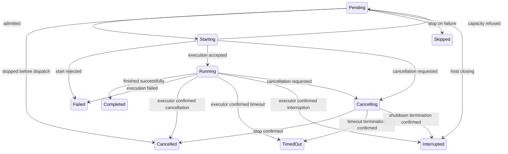
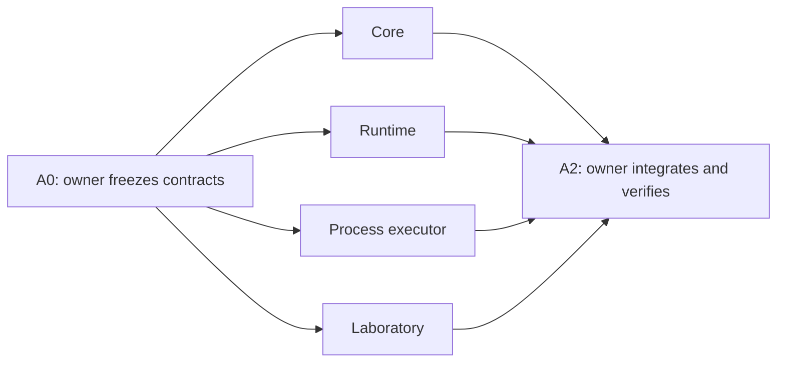

# Job batches — standalone engine and later Rush integration

Status: design only; this document does not authorize implementation or agent
launches. Revised 2026-10-08 for an autonomous, separately runnable component
and parallel implementation by several agents.

The original integration investigation used HEAD `322705af`. File names below
are navigation aids, not frozen line-number contracts; re-read the current
implementation before changing it.

## 0. Scope and delivery boundary

The first deliverable is ordinary Go code in this repository:

```text
internal/jobbatch/                  Independent engine and runtime.
internal/jobbatch/testdata/         Deterministic scenarios and replay inputs.
internal/jobbatch/lab/              Scenario and process executors for batchlab.
cmd/batchlab/                      Standalone development executable.
```

There is one module and one implementation. `batchlab` imports the package
that Rush will eventually use; it must not contain a second scheduler.
`internal/jobbatch/lab` is a consumer of the engine, not an engine dependency.
The engine/runtime depend only on the standard library. The command adapter
may reuse narrowly scoped platform process helpers, but not Rush's app,
coordinator, session services, provider configuration, or MCP owner.

**Current scope ends at a working autonomous engine plus batchlab.** No Rush
tool registrations, DB migrations, changes to existing launch paths, new
model prompts, or project pre-refactoring are prerequisites for that delivery.
Section 9 records the later integration work; it is not part of the first
implementation wave.

Required behavior, retained from the operator's original request:

- A batch contains tasks and/or nested batches.
- Parallel batches start eligible work up to their limit and wait for every
  started task. Sequential batches process direct children in order, stopping
  on failure or continuing according to policy.
- Notifications are per-item or aggregate; several batches can coexist.
- Items can be appended to a nonterminal batch. Any item/subtree can be
  stopped. Task output can be inspected. Message-capable executors can receive
  input at any nesting depth.
- Success, failure, cancellation, timeout, interruption, and skipped work are
  distinct. An executor reports outcomes explicitly; the engine never
  interprets natural-language answers.
- Every independent CLI-command, MCP-call, or agent launch will eventually
  enter as a batch with one task. An existing batch's leaf is not wrapped
  again. This is a future integration invariant, tested abstractly now.

Job batches are not the existing `fs_*` batching utilities. This component
owns group scheduling and policy, not filesystem-operation atomicity.

## 1. Architecture and ownership of truth

### 1.1 Pure engine

`Engine` owns a forest of batch trees and their shared scheduling budget.
Keeping shared admission here prevents each batch from independently
allocating the supposedly global limit. The tree is an internal representation,
not another public scheduler.

The engine has no goroutines, mutexes, clock reads, filesystem/network I/O,
process launching, or Rush imports. It accepts events and produces an ordered
transition containing changed views, execution commands, and notifications.
The same ordered input events produce the same scheduling and terminal states.
Time-dependent behavior enters as explicit events, not `time.Now()` in core.

### 1.2 Runtime

One `Runner` owns one engine, potentially serving many root batches. It
serializes public requests and executor reports through one event loop.
Snapshots are requested through that loop, not by reading the engine from
another goroutine.

The loop applies events and schedules effects in transition order. Blocking
executor work happens outside it. Merely unlocking a mutex before calling an
executor is insufficient: separately dispatched transitions must not reorder
Start and Stop effects or issue duplicate executions.

### 1.3 Executors and observers

The executor owns the actual execution and its output. The engine sees task
identity, admission group, cancellation intent, and explicit completion.
CLI, MCP, and agent are adapter kind names, not branches of the pure engine.
Unknown executor kinds fail validation in the consumer before launch.

The diagnostic event feed is not durable storage and is not a promise of
exactly-once delivery across crashes. It must not block executor cancellation
or the state loop. The final snapshot/Wait result remains authoritative even
if an observer falls behind.

## 2. Contract to freeze before parallel implementation

The integration owner implements the shared declarations in phase A0 before
spawning implementers. All slices use those declarations. The following names
and semantics are the shared contract, not competing design suggestions.

```go
type ID string
type Mode string       // Parallel, Sequential.
type OnFail string     // StopOnFail, ContinueOnFail.
type Notify string     // NotifyEach, NotifyAll.
type State string      // See section 3.

type TaskSpec struct {
    Kind    string
    Group   string
    Payload json.RawMessage
    Timeout time.Duration // Zero means no item timeout.
}
type BatchSpec struct {
    Mode        Mode
    OnFail      OnFail
    Notify      Notify
    MaxParallel int
    Items       []Spec
}
type Spec struct {
    Task  *TaskSpec
    Batch *BatchSpec // Exactly one of Task/Batch is set.
}
type Limits struct {
    MaxConcurrent int
    ByGroup       map[string]int
    MaxDepth      int
    MaxNodes      int // Per root, including its nested batches.
}
type Result struct {
    State   State
    Summary string
    Details json.RawMessage // Opaque; never logged automatically.
}
type Launch struct {
    ID    ID
    Token uint64 // Admission-attempt identity.
    Task  TaskSpec
}
type Executor interface {
    Start(context.Context, Launch, func(Result)) (Execution, error)
}
type Execution interface {
    Stop(context.Context) error
}
type OutputReader interface {
    ReadOutput(context.Context, uint64) (OutputChunk, error)
}
type Messenger interface {
    Inject(context.Context, json.RawMessage) error
}
```

Lab adapter contracts (bodies belong to their A1 slices, not A0):

```go
// In package lab; ProcessOptions defines a positive retained-output byte cap.
func NewProcessExecutor(ProcessOptions) (jobbatch.Executor, error)
func NewControlledExecutor() *ControlledExecutor
func (c *ControlledExecutor) Complete(context.Context, jobbatch.ID, jobbatch.Result) error
func (c *ControlledExecutor) ReleaseStart(context.Context, jobbatch.ID) error
```

Laboratory owns the kind-routing executor for `process` and `controlled`;
it dispatches to those factories, not to a second scheduling implementation.
Payload structs and gate semantics are frozen in A0. Concrete Engine, Runner,
Batch, and executor structs are defined by their owning slices; shared files
contain data contracts, not empty structs or function-body placeholders.

Public core API:

```go
func NewEngine(Limits) (*Engine, error)
func (e *Engine) Apply(Event) (Transition, error)
func (e *Engine) View(ID) (NodeView, bool)
func (e *Engine) Snapshot(ID) (BatchView, bool)
```

Public runtime API:

```go
func NewRunner(context.Context, Limits, Executor) (*Runner, error)
func (r *Runner) Submit(context.Context, ID, Spec) (*Batch, error)
func (r *Runner) Add(context.Context, ID, []Spec) ([]ID, error)
func (r *Runner) Stop(context.Context, ID) error
func (r *Runner) CapacityAvailable(context.Context, string) error
func (r *Runner) View(context.Context, ID) (NodeView, error)
func (r *Runner) Snapshot(context.Context, ID) (BatchView, error)
func (r *Runner) Events(context.Context, uint64) (EventPage, error)
func (r *Runner) Output(context.Context, ID, uint64) (OutputChunk, error)
func (r *Runner) Inject(context.Context, ID, json.RawMessage) error
func (r *Runner) Release(context.Context, ID) error
func (r *Runner) Close(context.Context) error
func (b *Batch) Done() <-chan struct{}
func (b *Batch) Wait(context.Context) (Summary, error)
```

A0 also fixes concrete JSON tags, enum strings, error sentinels, and these
supporting types in the contract files:

- `Event`: Submit, Add, StopRequested, Started, StartRejected, Settled,
  CapacityAvailable, DeadlineExpired, HostClosing, Release. Events identify
  root/node plus launch token where applicable. Capacity rejection is typed.
- `Command`: StartLeaf and StopLeaf, always with node and launch token.
- `Transition`: monotonic sequence, accepted event, changed node views,
  commands, selected notices, newly settled roots. Invalid requests produce
  no mutation, no sequence increment, and no execution commands.
- `NodeView`: id/root/parent/ordinal, kind, state, cancellation reason,
  launch token, outcome, and control-error code for explicit inspection.
  Payload is not a view field; outcome text is not safe diagnostic metadata.
- `BatchView`/`Summary`: root state and terminal-task counts; count leaves,
  not both a nested batch and its descendants.
- `OutputChunk`: bytes, next byte cursor, EOF, and explicit truncation/gap
  information. Output storage/retention belongs to the executor.
- `Record`/`EventPage`: cursor-based lifecycle records with bounded retention
  and explicit gap error. Include identity, event/state, counts, and input
  reference; exclude Result.Summary/Details and opaque inputs. Events waits
  for new records without blocking the state loop. A consumer that misses
  records can recover current state through Snapshot/Wait, not reconstruct
  the missing journal as though it were complete.

No fake implementations of Engine/Runner methods are needed to unblock
siblings: A0 supplies contracts; final compilation waits for the joint handoff.
Do not add a mandatory Store interface or DB-style transaction to this scope.

### 2.1 IDs, ownership, and validation

Callers supply a unique nonempty root ID; the contract reserves `.` as the
item-path separator. Descendant IDs are deterministic append-only ordinal
paths, such as `root.1.2`. Parent and ordinal are explicit view fields;
consumers must not parse IDs for ownership. Duplicate root submission fails
without executing anything. Rerunning work requires a new root ID.

Root specs must be batches. A consumer normalizes a standalone task to a
one-task batch once at ingress. This normalization preserves the caller's
selected policy; it does not normalize every nested leaf.

Validate a complete Submit/Add subtree before accepting any of it: exactly
one node shape, known mode/policy, nonnegative timeout, valid limits and IDs,
depth/node bounds, and no irrelevant task/batch-only fields. Add is atomic
as a request, not as execution across tasks.

Require positive global, depth, and node limits. A missing group limit
inherits the global budget. Batch MaxParallel zero inherits the applicable
budget; Sequential permits only zero/one. Numeric machine-specific defaults
belong to batchlab/Rush, not hardcoded command/agent categories in core.

Mode is explicit; absent Notify normalizes to NotifyAll. A Sequential batch
with absent OnFail uses StopOnFail; Parallel requires OnFail to be empty.
Group limits, when supplied, must be positive. Root depth is one and ordinals
start at one. These defaults are resolved before subtree validation, once.

Runner copies externally mutable specs/results once at the request/report
boundary, then transfers ownership of its events to Engine.Apply; direct core
callers must also transfer immutable inputs. Public snapshots cannot mutate
internal state. Do not clone the entire forest on every transition; report
changed nodes only.

## 3. State, scheduling, and races

### 3.1 Lifecycle

Leaf states:



Natural completion may arrive before Start returns. Runner buffers that
report and publishes Started before Settled for an accepted start. A failed
Start is authoritative: it must return no accepted execution, and any
completion callback made by that rejected attempt is ignored and reported
as an executor-contract violation in diagnostics.
Start must honor cancellation and finish its setup in bounded time. A nil
error with a nil execution is a failed start. If cancellation was already
accepted, a rejected start confirms that no execution exists and settles
with the latched cancellation cause, not a fresh Failed/Pending state.

Starting/Cancelling still hold their reserved slots until rejection or
confirmed execution termination. A successful Start means accepted work,
not completed work. At most one accepted execution per leaf. Rejected
admission attempts have distinct tokens and may retry without side effects.

Stop/timeout records intent and requests executor cancellation. It does not
pretend a process, MCP call, or agent has already stopped. Executor Stop
returning nil only acknowledges the request; completion confirms termination.
Stop failure leaves the item nonterminal with a surfaced control error.

Batch states are Pending, Running, Cancelling, and terminal. For a batch
that was not explicitly stopped, aggregate after all children are terminal:
any Failed/TimedOut/Interrupted => Failed; otherwise any Cancelled => Cancelled;
otherwise Completed. An explicitly stopped batch ends with its requested
cancellation reason; descendant failures remain visible in the counts.
Skipped is only produced by stop-on-fail, never used to conceal a start error.

Empty batches complete immediately, have zero task counts, and then reject
Add. An item asking for input is not terminal and does not free capacity;
waiting/interaction details belong to its executor.

### 3.2 Concurrency and fair admission

- Sequential orders direct children. A nested batch must settle before the
  next direct sibling starts; its own mode governs execution within it.
- Parallel admits in append order up to the batch's budget. An ancestor's
  MaxParallel counts all Starting/Running/Cancelling leaves beneath it,
  not just direct children. Batch nodes consume no executor slot.
- One engine shares global and group budgets across all roots. Select
  eligible roots round-robin, then eligible leaves in ordinal order.
  A group-blocked root must not prevent other eligible groups from running.
- Releasing a slot considers waiting work across the forest, including a
  batch that never managed to start its first leaf.
- A typed capacity refusal before acceptance returns the leaf to Pending,
  releases its reservation, and blocks immediate retry for that admission
  group. Resume on explicit CapacityAvailable or relevant accepted-work
  settlement. Do not busy-loop or wait only for that same tree to settle.
- Operational start failure is Failed, not a capacity refusal. Automatic
  retries of failed tasks are out of scope.

### 3.3 Linearization rules

The event-loop acceptance order, not wall-clock callback order, decides:

1. **Add vs last completion:** Add accepted first extends the batch;
   completion accepted first makes it terminal and subsequent Add fails.
2. **Stop vs dispatch:** stop cancels undispatched tasks. An already
   authorized Start may be in flight; its context is cancelled and the
   returned execution is stopped before waiting for its final report.
   A Start entered with an already-cancelled context must do no side effects.
3. **Stop vs natural completion:** Settled accepted first keeps its natural
   terminal state. Stop accepted first latches cancellation as terminal cause;
   retain the executor's reported outcome as details, not as a second notice.
4. **Repeated/late reports:** reports for terminal nodes or stale launch
   tokens cannot release capacity twice, restart work, or change the winner.
5. **Timeout vs Stop:** the first accepted cancellation cause is retained.
   A later timer cannot relabel an operator stop or a completed task.

Report callbacks must return without waiting for the event loop, including
callbacks invoked synchronously by Start. Use a per-attempt completion latch,
not a blocking callback channel that deadlocks Start. Executor errors/panics
must settle accepted work once; rejected work must not leak a reservation.

Public operation contexts bound request submission/waiting, not task lifetime.
Cancellation of Batch.Wait alone does not stop work. Runner's host context
or explicit Stop controls work lifetime. Rush's eventual synchronous adapter
will explicitly connect caller cancellation to Stop.

Host shutdown is distinct from user Stop: reject new work, request execution
termination with Interrupted intent, and bound Close by its caller context.
A timed-out Close returns an error and must not report unconfirmed tasks
terminal. Restart/resumption and cross-process delivery are later work.

## 4. Notifications, output, and injection

Separate three concepts:

- Diagnostic lifecycle records describe every accepted transition.
- Selected notices implement NotifyEach/NotifyAll.
- Batch.Wait returns one root result; it is not an extra user notification.

Root completion produces one selected root notice. For descendant completion,
NotifyEach applies to direct children; an ancestor NotifyAll suppresses
ordinary notices inside its subtree. A nested aggregate may be announced by
its NotifyEach parent without repeating descendant output. Question/input
requests must not be suppressed by completion-notification policy.

One-task ingress defaults to NotifyAll. Its adapter delivers either the
synchronous result or the root completion notice, never both plus a leaf
notice. Opt-in NotifyEach can expose lifecycle information, but must not
duplicate the full user-facing result.

Output/Inject resolve node ownership explicitly and are callable at any depth.
Batch nodes and executions without OutputReader/Messenger return typed
unsupported-operation errors. No silent no-op injection. Retain handles for
settled-task output until Release(root); injection into terminal work fails.
Release is refused while work is nonterminal. It frees retained tree/output
data without invalidating an immutable summary; retain a small root-ID
tombstone for the Runner lifetime so an old ID cannot launch new work.

An execution's input callback must not call back synchronously into a
blocking Runner operation. Output reading, injection, and Stop run outside
the state loop; their errors are surfaced to their callers.
Question/input transport remains an executor/host concern. A paused lab
execution can advertise that state through inspected output and accept Inject;
the core does not need an agent-specific question event to schedule it.

## 5. Batchlab: separate runnable verification

Commands to implement:

```bash
go run ./cmd/batchlab run scenario.json
go run ./cmd/batchlab run scenario.json --events events.jsonl
go run ./cmd/batchlab replay scenario.json events.jsonl
go test ./internal/jobbatch/...
go test -race ./internal/jobbatch/...
```

`run` uses the real Runner. Scenario JSON declares root specs, scripted control
actions (Add/Stop/Inject), limits, and payload references. Use two executors:

1. **Controlled executor:** explicit completion/start-refusal gates and input
   requests. It permits reproducible interleavings without sleep-based tests.
   It is a development/test fixture, not a production MCP/agent fallback.
2. **Process executor:** real program + argv, optional cwd, bounded retained
   stdout/stderr, exit status, cancellation, and live output reading.
   Never run arbitrary shell text implicitly. Stop only its own child
   process/tree; use existing platform isolation helpers where appropriate.

Runner implements execution timeouts outside core using standard timers;
unit tests use synctest/barriers instead of real-time sleeps. Timeout starts
at authorized execution, not time spent queued. A timeout requests termination
and settles TimedOut only after confirmation. batchlab imposes an explicit
overall wait bound on each smoke scenario so a broken executor is reported as
unfinished, not silently passed.

Cancellation of the invocation and the scenario wait bound must always enter
Runner.Close with a bounded cleanup wait. A missing program/nonzero exit,
failed aggregate, and unfinished cleanup return nonzero CLI exit status;
no successful exit solely because a scenario's control script ended.

The journal records sequence, input-reference ID, node/launch identity,
transition reason, and outcome state. Do not print task payloads, injected
messages, raw details, command arguments, or agent prompts by default.
Task output is available through explicit inspection, not copied into every
completion log.

`replay` reconstructs pure-engine control/completion events using the supplied
scenario's payload references. It compares final states, counts, and command
ordering. It must never instantiate an executor or rerun processes.
Reject missing/mismatched references, sequence gaps, and incompatible format
versions. A replay of a cancelled/failed run reproduces that outcome.

Do not build a daemon, RPC transport, or second Rush CLI inside batchlab.
All help and examples must describe real supported behavior.

## 6. Autonomous acceptance matrix

These are behavioral tests, not tests of source text, import lists, function
counts, forwarding, or copied constants. Agent reports are not verification.

### 6.1 Engine and admission

- **E1:** standalone-task normalization and an explicit one-task batch have
  equivalent execution/outcome; nested leaves are not wrapped twice.
- **E2:** sequential and nested sequential ordering; parallel overlap and
  ancestor limits; aggregate counts include each leaf once.
- **E3:** StopOnFail skips only pending successors after Failed/TimedOut/
  Interrupted; ContinueOnFail executes successors; Cancelled alone does not
  trigger StopOnFail.
- **E4:** several roots/groups share budgets; freeing work in root A starts
  pending work in root B; no starving an eligible group behind a blocked one.
- **E5:** capacity refusal performs no execution, queues without spinning,
  retries only on CapacityAvailable or relevant accepted-work settlement,
  and ultimately runs once.
- **E6:** stop leaf/subtree/root; sibling isolation; no false terminal state
  before execution termination; repeated Stop is safe.
- **E7:** Add ordering, atomic rejection of invalid subtrees, Add/last-settle
  race, empty batch, duplicate root ID, depth/node-limit boundaries.
- **E8:** terminal result/notice emitted once; stale tokens and duplicate
  reports cannot change the winner or release a slot twice.
- **E9:** snapshots/spec ownership, Release restrictions, and diagnostics
  excluding opaque task/result payloads.

### 6.2 Runtime and laboratory

- **R1:** immediate completion inside Start, start error/panic, Stop before
  Start returns, and concurrent Add/Stop/Settled; no deadlock or leaked slot.
- **R2:** timeout vs natural completion/operator stop under virtual time;
  Wait cancellation does not implicitly stop work; HostClosing is distinct.
- **R3:** blocked/failed observers do not freeze scheduling/cancellation;
  cursor gaps are explicit and final snapshots remain correct.
- **R4:** unsupported output/injection, live output, paused message-capable
  fixture resumed by Inject at nested depth, and terminal injection refusal.
- **L1:** three real short command items, including one nonzero exit:
  correct individual results and failed aggregate; no model/API needed.
- **L2:** real command cancellation plus partial-output inspection; Stop
  waits for the child to terminate and does not kill unrelated processes.
- **L3:** controlled multi-root scenario exercises Add, capacity release,
  failure policy, nested stop, and both notification modes.
- **L4:** replay preserves structural final state and performs no side effects,
  even if the scenario includes a process that would write a file.

Use channels/barriers or synctest for timing-sensitive unit tests. Property/
fuzz tests check invariants after event sequences with reproducible seeds and
publish failing sequences. Do not manufacture CPU/memory load to test limits;
controlled held tasks demonstrate admission limits.

## 7. Parallel-agent execution plan

The orchestrator owns decomposition, contract approval, shared-file edits,
integration, and verification. Several agents implement independent slices;
they do not independently redesign the API. No agent is launched by updating
this document.

### 7.1 A0 — shared prerequisite, inline by integration owner

Before fan-out:

1. Freeze the declarations and event/error semantics from sections 2-4 in
   `types.go`, `events.go`, `executor.go`, and `runtime_types.go`.
2. Define scenario/journal schema and lab factory declarations in
   `internal/jobbatch/lab/schema.go`: version, references, scripted actions,
   process payload (program/argv/cwd/output limit), process-executor factory,
   controlled-executor factory, and safe output format. Give Laboratory a
   callable process factory contract before parallel implementation starts.
3. Record named smoke scenarios and acceptance IDs. Establish platform
   process helper behavior before assigning the process slice.
4. Set the target branch/worktree and allowed file ownership. No commits,
   pushes, Rush integration, library bumps, or nested agent launches by
   implementers.

Contract changes later belong only to the integration owner. An implementer
reports the missing field/method and its consumer-visible reason; the owner
updates the contract and informs all affected agents before they depend on it.
Do not ask sibling agents to edit the same shared declarations.

### 7.2 A1 — genuine parallel implementation wave



| Slice | Owned files | Inputs from A0 | Required output |
|---|---|---|---|
| Core | `internal/jobbatch/engine.go`, `tree.go`, `tree_apply.go`, `admission.go`, `view.go` and their tests | Types, events, transition commands, limits | E1-E9; pure forest scheduling and immutable views |
| Runtime | `internal/jobbatch/runner.go`, `runner_dispatch.go`, `runner_control.go`, `runner_observe.go` and their tests | Engine API, Executor, runtime declarations | R1-R4; event-loop ordering, attempts, cancellation, handles |
| Process executor | `internal/jobbatch/lab/process*.go` and process tests | Executor/OutputReader, process payload schema | L1-L2; real process output and safe tree termination |
| Laboratory | `internal/jobbatch/lab/scenario.go`, `controlled.go`, `journal.go`, `replay.go`, `cmd/batchlab/*.go`, lab-owned testdata and tests | Runner API, process factory API, scenario schema | L3-L4; CLI, controlled execution, replay and help |

Runtime may write against the frozen Engine API while Core is unfinished;
Laboratory may do the same against Runner and the process factory. Shared
API bodies are never replaced with placeholders merely to compile early.
Actual compilation/execution is the joint gate, not a reason to serialize
independent writing work.

Process and Laboratory agents use separate testdata subdirectories. Core/
Runtime use package-local helpers in their own test files, not a shared
mutable helper file. README/changelog, contract files, and cross-slice
reconciliation remain owned by the integration owner.

A slice task supplied to an agent must include the complete scope, file
ownership, relevant acceptance IDs, fixed interfaces, exclusions, and handoff
requirements. Supply the plan/artifact path instead of an incomplete summary.

Each implementer skips build, lint, tests, and formatters during the shared
editing wave. It statically reviews its slice and hands off:

- exact touched files and implemented acceptance IDs;
- executor assumptions and any unresolved contract issues;
- tests written, commands needed, and specific unverified behavior;
- no claim of successful execution.

Agents do not touch each other's slices. The orchestrator keeps working
during fan-out and does not poll or launch duplicate agents for the same job.

### 7.3 A2 — integration and verification, one owner

After every A1 slice has handed off:

1. Reconcile contracts and remove dead/duplicate code; format changed Go files.
2. Compile the package and batchlab together. Run focused core/runtime/lab
   tests, then `-race` where the platform supports it; record any actual
   platform prerequisite instead of claiming an unexecuted race check.
3. Run L1-L4 through batchlab and inspect output/process termination/replay.
   Tests alone do not prove the command executable works.
4. Run repository-required checks once after integration. Do not run several
   memory-heavy suites concurrently. Fix failures in the same work cycle.
5. Update documentation with the actual commands, semantics, and verification
   limits. Remove temporary scripts/binaries; retain useful scenario fixtures.

If a real defect spans slices, the owner assigns disjoint corrective work or
fixes the shared boundary itself. Any changed slice is reverified with its
affected behavioral tests and smoke path. Do not widen the scope into Rush
integration to make the autonomous deliverable appear complete.

Autonomous completion means the real Engine, Runner, command executor, and
batchlab all work together, with the matrix satisfied. A compiling skeleton,
mock-only program, or pending integration gate is not completion.

## 8. Decisions fixed now and decisions deferred

Fixed for autonomous implementation:

- Notifications default to NotifyAll; callers may request NotifyEach.
- Cancelled does not trigger StopOnFail; aggregate still exposes cancellation.
- Empty batches immediately complete; Add to terminal/cancelling batches fails.
- No automatic task retries; typed pre-execution capacity refusal is different.
- No automatic execution resumption after host restart.
- Scheduling limits are caller supplied and shared across roots in one Runner.
- Opaque results and capability interfaces, not agent-text interpretation.

Deferred to Rush integration, without blocking autonomous development:

- Default numeric limits and mapping to existing per-session admission caps.
- Durable root/leaf representation, transactional delivery, and recovery.
- Required task_outcome for new explicitly outcome-aware agent work.
  Preserve the existing success contract for automatically wrapped legacy
  agents until an explicit migration is approved; do not silently make all
  their text-only completions fail because they are now singleton batches.
- Which operator/model controls expose additional batch items and nesting.

The old recommendations of 4 parallel tasks, 16 hard maximum, 2 commands,
4 agents, depth 3, and 100 nodes are integration proposals, not engine laws.
Do not run every heavy command at once merely because a batch is parallel.

## 9. Later Rush integration roadmap

This is a separate work package, started only after autonomous acceptance.
It must be planned against the then-current repository, not old file offsets.

### 9.1 Addressed pre-refactoring

- Pure move of job-control methods from `work_ledger.go` to
  `work_ledger_jobctl.go`; preserve observable behavior and ownership checks.
- Extract shared permission-inheritance/executor-launch setup from
  `asyncTool.launchExecutor`. Separate starting work from synchronous waiting,
  inline-window delivery, and detached "started" responses.
- One post-commit terminal observation seam for the adapter, outside ledger
  locks and guarded by claim identity. An in-memory duplicate or stale
  execution cannot settle another claim's leaf.
- One tool construction path retaining hooks, permissions, restricted-run,
  folder scope, and agentguard. A leaf reuses policy-wrapped execution without
  recursively reapplying the batch ingress wrapper.

No second registry, no wholesale coordinator rewrite, and no MCP
connection/protocol refactor just to accommodate batching.

### 9.2 Execution cutover

Ordinary command/MCP/agent ingress becomes a one-task root. Explicit groups
submit multiple tasks to the same scheduler. Adapters reuse existing
executors; the core does not import Fantasy or parse Rush tool input.

Preserve existing response/cancellation semantics:

- SDK/synchronous calls may wait for the root outcome, with caller context
  cancellation explicitly mapped to Stop; they are not automatically detached.
- CLI/web asynchronous calls and explicit batch_run may return started plus
  later aggregate delivery. Web Drain must not block a turn for a long batch.
  There is no blanket "every batch is never sync" rule and no blanket SDK ban.
- The root/leaf ack gate and durable claim precede externally visible effects.
  Singleton wrapping must not duplicate rows, cap accounting, results, or
  billable notification turns.
- Agent completion comes from settled delegation work, not merely Run()
  returning after a child model turn. Questions and descendant work keep
  the item nonterminal; existing inject/resume ownership rules remain.
- MCP leaves use `tools.Tool.Run` -> `Owner.RunTool(ctx, ...)`. Stopping the
  call cancels its execution context without killing the shared MCP server
  session (existing MCP cancellation invariants).
- Existing job-control code may record cancellation before its executor
  returns. The adapter must not treat that row alone as proof of physical
  termination: hold Runner admission until the corresponding executor has
  actually finished. Test that a stopped leaf cannot free capacity early.

Shared admission must account for Rush work outside a batch during migration.
A ledger refusal needs a capacity-release signal from that work as well.
Root orchestration records must not occupy all execution slots and leave no
room for leaves. Define record/accounting rules before the DB migration.

### 9.3 Outcomes, persistence, and recovery

`task_outcome(success|failure)` belongs to the agent adapter, not the engine.
New outcome-aware agent items can require it; undeclared outcome is Failed
only where that contract was explicitly selected. Re-declarations are scoped
to a new execution/attempt, not allowed to overwrite an already terminal leaf.

Persist batch structure and stable execution mappings using existing SQLite/
sqlc conventions. Choose tables/migration timestamps at implementation time;
do not reserve the original plan's historical filename. Preserve the ledger's
shutdown-vs-user-stop distinction, claim CAS, ack gate, and delivery state.

After a host crash, expose interrupted work and unstarted descendants without
silently rerunning side effects. Replay of a diagnostic trace is not execution
recovery. Exactly-once durable notification requires its own transactional
contract; a callback from Runner alone does not provide it.

### 9.4 Model tools, operator CLI, and web

Model tools: batch_run, batch_add, batch_status, batch_stop. Commands:
`rush batch run|show|add|stop`. `batchlab` already proves model-less execution;
Rush-specific commands add authenticated ownership and cross-process control.
Web presents the same hierarchy and operations, not a separate scheduler.

Control routing, job_kill/job_output, and inject must resolve stable owner/
item/execution identities. Do not bypass hooks/permissions or allow a child
to block awaiting its own parent batch. Generic tool items must not recursively
invoke scheduler/control tools; use explicit task kinds for supported work.

Integration acceptance must include:

- single-task CLI, MCP, and agent launches with unchanged results and exactly
  one consumer completion; sync caller cancellation and detached work;
- parallel/sequential/nested groups, failure policy, Add, subtree Stop,
  cross-process operator control, and group-aware cap accounting;
- immediate finish before ack, duplicate tool-call retries, late old-claim
  reports, crash/shutdown recovery, and no duplicate notices;
- held child questions, input injection at nested depth, declared failure,
  and unchanged legacy-agent success semantics;
- interrupted MCP call without connection destruction and actual WebUI
  controls verified in the browser.

No integration phase is marked complete merely because batchlab passed.
